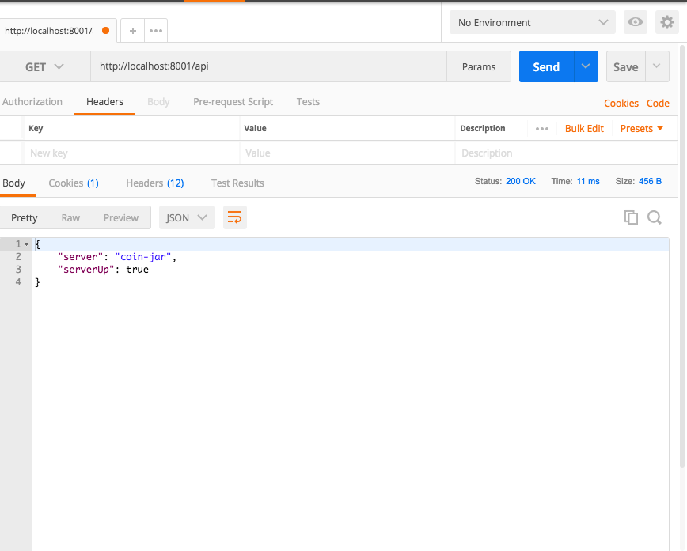

# SakuraApi
# Lesson 1 - My first API

In this lesson we will build our first API using SakuraApi.  
We're going to start small and build up.  We will end this session with an API that has one number.
You can ask for the number, and you can increment the number.    

## Prerequisites 
Let's assume you have a development capable computer.  Let's assume you are breathing.   
- [Node and npm](https://www.npmjs.com/get-npm) 
- [Docker](https://docs.docker.com/engine/installation/)

optional
- [Postman](https://www.getpostman.com/)

## Start the project
### Install the SakuraApi CLI 
The Sakura API CLI aka sapi is installed using the code below
```
npm install --global @sakuraapi/cli@latest 
```
It can be simplified as 
`npm i -g @sakuraapi/cli`.  

Setting up a SakuraApi project takes a lot of work – __sapi__ makes it easy. Before we start a new project, 
familiarize yourself with the cli by simply typing `sapi`. This will result in a help screen.

If you want help with a specific command, you can get that too. Try sapi init --help.

Initializing a new project
Ok, let’s get started.

First, navigate to a directory where you want to experiment. Next, run sapi init test, where test could be whatever you 
want the output directory to be named. Note, if you just run sapi init it will attempt to setup a SakuraApi project in 
the current directory.

I keep all my work in a dev directory in my home folder, so my initial setup would look something like this:

```shell
cd ~/dev/tmp
sapi init test
cd test
```

__sapi__ will ask you a series of questions to help you setup your project.

The first non-obvious question it asks you is what role you want your SakuraApi server to fulfill. 
There’s three options: none, issuer, audience. If you press <enter>it will list the options for you. 
If you select none, sapi will create a barebone installation with no authentication. 
If you select issuer sapi will create a Json Web Token (JWT) issuer. 
An issuer is responsible for authenticating users and generating JWTs which the client application can then pass back 
to the issuer or to audience servers to prove the user is authenticated. If you select audience, sapi will setup your 
project as an audience server  which is able to understand JWTs issued by the issuer, but the audience server has no 
authentication responsibilities. It relies on the issuer for its user authentication. Remember, SakuraApi is built from
 the ground up to support microservices, hence the different roles.
 
To keep things simple for this lesson, select __n__ for __none__

__sapi__ will then present you with the package.json file it will be creating. Press enter to accept the changes. 
__sapi__ will then create all the relevant files it needs for your configuration and it will run `npm init`.

Once __sapi__ is done, go into your project’s directory and run `npm test`. You should see that 4 unit tests passed.

```angular2html
cd test
npm test
```

Now, type `npm start`. You now have a running SakuraApi server running on localhost:8001. Press <control-c> to stop the server.

You can see the server running by opening Postman and doing a GET request to localhost:8001/api.  




